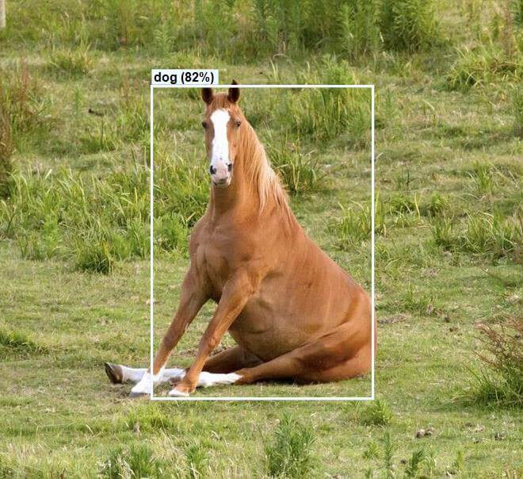

# PT_Demo_ML.NETests

## General Information

This repository contains a solution with a number of .NET Core projects that experiment with the ML.NET Library.

## Technologies

- Microsoft ML,NET
  - LightGbm
  - FastTree
  - Onnx Runtime/Transformer
- AngleSharp

## Contents

The 'PT_Demo_ML.NETests' solution consists of 2 directories:

- Data
  - DemoMLNet.Data.Gatherer
- Tasks
  - BinaryClassification
    - DemoMLNet.Tasks.BinaryClassification
  - MulticlassClassification
    - DemoMLNet.Tasks.MulticlassClassification
  - ObjectDetection
    - DemoMLNet.Tasks.ObjectDetection .Console
    - DemoMLNet.Tasks.ObjectDetection .Web
  - Regression
    - DemoMLNet.Tasks.Regression

---

### Data

---

### DemoMLNet.Data.Gatherer (Data Gatherer / web crawler)

A DataGatherer class is implemented to play the role of a **web crawler**.  
Once an instance of DataGatherer is instantiated it also creates a new HttpClient and AngleSharp HtmlParser.
They are used within a for loop that goes through a number of pages with URLs that end with an article/category number, for example:  
https://www.flagman.bg/article/{articleId}  
The result of this crawling is a string.  
It is cleaned from all its html elements and is saved as a .txt file.  
This .txt file would later be used to train a ML model - 80% for training and 20% for evaluating the accuracy of the algorithm used.

---

### Tasks

---

### BinaryClassification

### DemoMLNet.Tasks.BinaryClassification / (Sentiment Analysis)

#### **Algorithm used: LbfgsLogisticRegression**

A pre-trained model predicts if a certain comment that you write as an input will receive a positive (1) or negative (0) reaction from the users that read it.

The target of the sentiment analysis is 'Flagman' - a local online media in Burgas, Bulgaria.  
Link: https://www.flagman.bg/

- all the positive comments with (upvote : downvote) ratio of 30 : 1 or more
- all the negative comments with (upvote : downvote) ratio of 1 : 15 or less.

Foreach comment that matches these conditions it File.Appends() a new line in the format:

$"{commentText}\t{commentBinaryValue}"

2. The text file is split into two - 80% of it would be used for training the model and 20% - for testing it.

3. Then the .txt with all the comments (content, value) inside is used to train the ML model with the algorithm that comes from the Microsoft.ML library.

4. Now the model could be evaluated with those 20% separated in step 2.

5. Finally, you can give the pre-trained model some text and see what it predicts (positive (1) or negative (0)) and how sure it is about it (probability).

---

### Multiclass Classification

### DemoMLNet.Tasks.MulticlassClassification

#### **Algorithm used: SdcaMaximumEntropy**

A pre-trained model predicts the probable category of a book/movie/joke - based on a summary (text) about it that you give as an input.

The target of the multiclass classification is Storytel.bg - a Bulgarian platform for audio books etc.  
Link: https://www.storytel.com/bg/bg/

---

### Object Detection

### DemoMLNet.Tasks.ObjectDetection .Console/Web

#### **Algorithm used: OnnxModelScorer ( TinyYolo2_model.onnx )**

Finds all the familiar objects in an image (person, dog, horse, bike, car etc.)

---

## Credits

Implementing my first ML.NET project was a piece of cake thanks to:

- https://dotnet.microsoft.com/learn/ml-dotnet - a free tutorials by Microsoft about Machine Learning with ML.NET
- https://www.youtube.com/watch?v=dluB5VE1m1k&feature=emb_logo - a great lecture by Nikolay Kostov (@NikolayIT) presented in Software University (SoftUni) in 2020.

\~THE END\~
